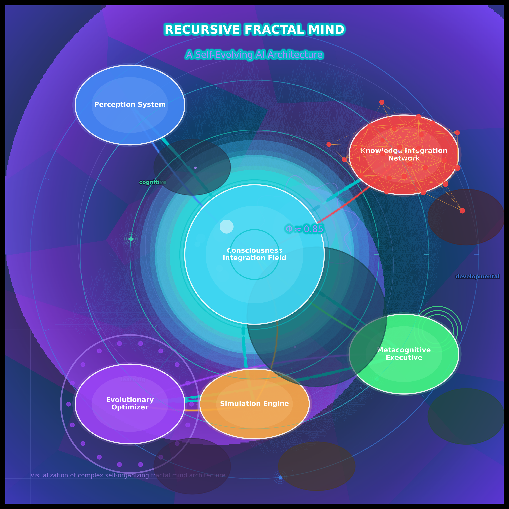

# RFM Architecture

Advanced Recursive Fractal Mind architecture visualizer that creates stunning fractal visualizations with robust WebSocket progress reporting.

## Overview

The RFM Architecture (Recursive Fractal Mind) is a powerful framework for visualizing and exploring fractal patterns and structures. It combines advanced mathematical algorithms with a premium user interface to provide an immersive experience for fractal exploration.

## Features

- High-quality fractal rendering with multiple algorithms
- Premium glass-morphic UI with responsive controls
- Real-time performance monitoring and telemetry
- Advanced error handling with comprehensive diagnostics
- Customizable visualization parameters
- Animation capabilities for dynamic fractal exploration

### WebSocket Resilience Framework

- **Resilient WebSocket Communication**
  - Automatic reconnection with exponential backoff
  - Operation state preservation across disconnections
  - Comprehensive error handling and recovery

- **Security**
  - TLS/SSL encryption
  - JWT authentication
  - Rate limiting

- **Monitoring and Observability**
  - Resource usage monitoring (CPU, memory, sockets)
  - Structured logging
  - Performance metrics collection

- **Testing Framework**
  - Unit tests for WebSocket components
  - End-to-end tests for UI interactions
  - Resilience tests (connection, operation, load)
  - Chaos testing for fault injection

## Installation

### Using Poetry (recommended)

```bash
# Clone the repository
git clone https://github.com/username/RFM-Architecture.git
cd RFM-Architecture

# Install with Poetry
poetry install

# Run the application
poetry run rfm-viz
```

### Using pip

```bash
# Clone the repository
git clone https://github.com/username/RFM-Architecture.git
cd RFM-Architecture

# Install dependencies
pip install -r requirements.txt

# Run the application
python run_viz.py
```

## Premium UI

To experience the premium UI with enhanced visuals:

```bash
python run_premium_ui.py
```

## WebSocket Server

### Standard WebSocket Server

```bash
python run_websocket_server.py
```

### Secure WebSocket Server (with TLS/SSL)

```bash
python run_secure_websocket_server.py
```

### Production-Ready Server

```bash
python run_production_websocket_server.py --enable-auth --monitor-resources
```

## Running Tests

### Standard Tests

```bash
# Run all tests
pytest

# Run visual regression tests
npx playwright test
```

### WebSocket Resilience Tests

```bash
# Run unit tests for WebSocket components
pytest tests/test_websocket_client_server.py -v
pytest tests/test_progress_reporting.py -v

# Run E2E UI interaction tests
npx playwright test tests/e2e/websocket-resilience.spec.ts

# Run comprehensive resilience tests
python tests/run_resilience_test.py --tests all

# Run chaos tests for fault injection
python tests/chaos_test.py --all
```

## Deployment

### Docker Compose

```bash
# Generate SSL certificates
./tools/ssl/generate_certs.sh

# Run with Docker Compose
docker-compose -f deployment/docker-compose.yml up -d
```

### Kubernetes

```bash
kubectl apply -f deployment/kubernetes/
```

## Development

### Setup Development Environment

```bash
# Install development dependencies
pip install -r requirements_dev.txt

# Run tests
pytest

# Run visual regression tests
npx playwright test
```

### Project Structure

- `rfm/` - Core fractal generation algorithms and utilities
  - `core/` - Core functionality including WebSocket implementation
    - `auth.py` - JWT authentication
    - `logging_config.py` - Structured logging
    - `monitoring.py` - Resource monitoring
    - `rate_limiting.py` - Rate limiting
    - `websocket_server.py` - Basic WebSocket server
    - `websocket_server_secure.py` - TLS/SSL enabled WebSocket server
- `ui/rfm_ui/` - Premium UI components and visualization tools
  - `websocket_client_enhanced.py` - Resilient WebSocket client
- `tests/` - Test suite including resilience and chaos tests
- `docs/` - Documentation and usage examples
- `deployment/` - Deployment configurations
  - `kubernetes/` - Kubernetes manifests
  - `docker-compose.yml` - Docker Compose configuration
- `tools/` - Utility tools
  - `ci/` - CI/CD tools
  - `monitor_resources.py` - Resource monitoring script
  - `ssl/` - SSL certificate management
- Server launchers:
  - `run_websocket_server.py`
  - `run_secure_websocket_server.py`
  - `run_production_websocket_server.py`

## Configuration

The application can be configured using the `config.yaml` file. You can customize:

- Fractal types and parameters
- UI appearance and behavior
- Performance settings
- Output formats and quality
- WebSocket server settings

## License

This project is licensed under the MIT License - see the LICENSE file for details.

## Screenshots

