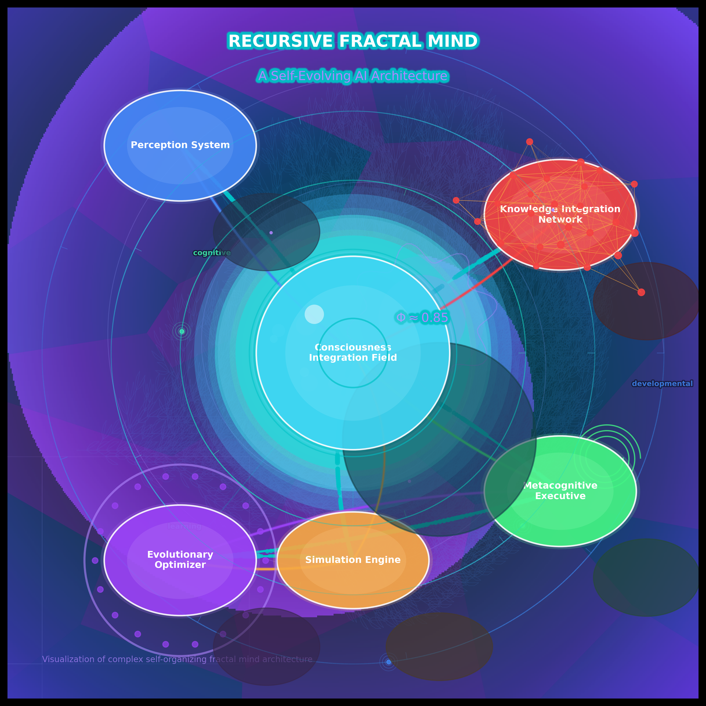

# RFM Architecture Visualizer

A production-ready visualizer for the **Recursive Fractal Mind** cognitive architecture with a glass-morphic UI, neon effects and responsive design.



## Features

- **Glass-morphic UI**: Modern translucent interface with depth and blur effects
- **Interactive Fractal Explorer**: Real-time WebGL-powered fractal visualization
- **Node-based Architecture Editor**: Visual editing of cognitive architecture components
- **Audio Feedback**: Immersive sound design for interactions
- **Resilient WebSocket Communication**: Robust progress reporting and real-time updates
- **Adaptive Layout**: Responsive design for different screen sizes
- **High Performance**: GPU-accelerated rendering with optimized computations
- **Component Showcase**: Gallery of UI components with interactive examples

## Getting Started

### Prerequisites

- Node.js 16+
- Python 3.8+
- GPU with WebGL support (recommended)

### Installation

1. Clone the repository:
   ```
   git clone https://github.com/ProtocolSage/rfm-architecture.git
   cd rfm-architecture
   ```

2. Install dependencies:
   ```
   # Install frontend dependencies
   npm install

   # Install Python dependencies (editable install so `rfm` and `rfm_ui` resolve without PYTHONPATH)
   python -m venv .venv
   source .venv/bin/activate  # On Windows: .venv\Scripts\activate
   pip install -e .
   pip install -r requirements.txt
   pip install -r requirements_dev.txt  # optional: dev tooling (pytest, black, flake8)
   ```

3. Run the development server:
   ```
   # Start the UI development server
   npm run dev

   # In another terminal, start the Python backend
   python run_websocket_server.py
   ```

4. Open your browser and navigate to `http://localhost:5173`

## Key Components

- **Dashboard**: Overview of system status and recent fractals
- **Fractal Explorer**: Interactive WebGL-based fractal visualization
- **Architecture Editor**: Node-based visual editor for cognitive architecture
- **Settings**: Comprehensive system configuration

## Technology Stack

### Frontend
- React 18
- Three.js + React Three Fiber
- Framer Motion
- TailwindCSS
- WebGL Shaders
- Howler.js + Tone.js (Sound System)

### Backend
- Python
- FastAPI
- WebSockets
- NumPy/CuPy
- OpenCL/CUDA (optional)

## Development

### Running Tests
```
# Frontend Tests
npm test

# Backend Tests — fast path (mirrors CI)
python -m pytest tests/test_progress_reporting.py -v

# Whole backend suite (some tests require dearpygui / a display)
python -m pytest tests/
```

A `justfile` at the repo root mirrors the CI jobs — `just test`, `just test-all`,
`just test-resilience`. Install [just](https://github.com/casey/just) or invoke
the commands directly.

### Secure WebSocket server & resilience tests

The secure launcher (`run_secure_websocket_server.py`) and the resilience
smoke tests load SSL certs from `tools/ssl/certs/`. Generate them once after
cloning:
```
just ssl-certs          # or: ./tools/ssl/generate_certs.sh
```
CI runs the same script in `.github/workflows/resilience-tests.yml`.

### Building for Production
```
npm run build
```

This will generate production-ready files in the `dist` directory.

## License

[MIT License](LICENSE)

## Special Thanks

Developed by Protocol Sage for the Recursive Fractal Mind project.
